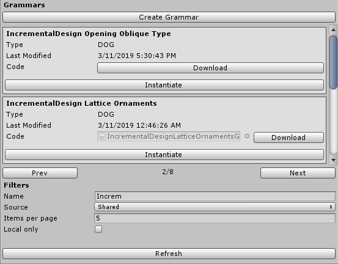
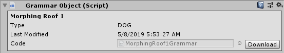

# MichelangeloUnity

This package brings Michelangelo service to Unity editor with many features that make it easier for developers to integrate procedural models into their projects.

## Contents

- [MichelangeloUnity](#michelangelounity)
  - [Contents](#contents)
  - [Installation](#installation)
  - [Quick Start](#quick-start)
    - [Log in](#log-in)
    - [Log out](#log-out)
  - [Creating Michelangelo objects](#creating-michelangelo-objects)
    - [SceneObject](#sceneobject)
    - [GrammarObject](#grammarobject)
  - [Generating meshes](#generating-meshes)
    - [Parse tree](#parse-tree)
    - [Compilation output](#compilation-output)
  - [Account info and energy](#account-info-and-energy)

## Installation

Extract provided [`.unitypackage`](https://github.com/Haaxor1689/MichelangeloUnity/releases/download/v1.0/MichelangeloUnity.unitypackage) into you project. This package uses dependencies [MessagePack](https://github.com/neuecc/MessagePack-CSharp) library, [RSG.Promise](https://github.com/Real-Serious-Games/C-Sharp-Promise) library. You can either use provided `.dll`s in `Michelangelo/Libs/` folder or install them yourself from NuGet using [NuGet for Unity](https://assetstore.unity.com/packages/tools/utilities/nuget-for-unity-104640) package.

## Quick Start

After importing this package into your Unity project you should see a new tab in your editor called Michelangelo. In this tab you will find everything related to this package.


### Log in

Before being able to use any of it's features, you first need to log in to the Michelangelo online service. You can do this in Michelangelo window (Michelangelo -> Michelangelo). If you don't have an existing account you can create one [here](https://michelangelo.graphics/Account/Register).


You can also log in from a C# script.

```cs
MichelangeloSession.Login("username", "password")
    .Then(userInfo => { /* logged in successfully */ })
    .Catch(error => { /* error occured */ });
```

> MichelangeloSession uses a **Promises** library for asynchronous web requests that you can check out [here](https://github.com/Real-Serious-Games/C-Sharp-Promise).

### Log out

You can log out in Michelangelo window.


Or from a C# script.

```cs
MichelangeloSession.Logout()
    .Then(userInfo => { /* logged out successfully */ })
    .Catch(error => { /* error occured */ });
```

> *Note:* All the session data is stored inside Unity's editor prefs and is cleared after logging out. Michelangelo editor window does not need to be opened for other functionality to work.

## Creating Michelangelo objects

Michelangelo generates meshes from grammars. You can learn more about Michelangelo's grammars in [user manual](https://www.overleaf.com/read/scvmgqtbbtmh). In MichelangeloUnity there are two approaches to creating meshes in your scene. You can either use a `GrammarObject` that links to your own or shared Michelangelo grammar online or use a `SceneObject` that specifies only a model *(see user manual ch. 1.2)*. Both of these objects can be created from Michelangelo tab.

### SceneObject

Scene objects are used for the simplest use cases where you only want to generate already defined goal and not create any new rules. First you need to specify a **Goal** which is a case insensitive string. This specifies what you want to generate *(f.e. in example the goal is **Chair** which will try to find any rule that generates a chair in Michelangelo's cloud database of grammars)*. Also you can set the **Size**, which will specify a box area that the mesh should fit in. Selecting **Center on pivot** will make sure that the pivot of generated mesh is at the bottom center of it's bounding box. Lastly with **Restrict** you can restrict where the rules to satisfy this goal can be found *(f.e.b y selecting **Mine** only grammars connected to your account will be used)*.


You can also instantiate `SceneObject` from C# scripts. This function will return a new `GameObject` with a `SceneObject` script attached and correctly set up.

```cs
var newGameObject = SceneObject.Construct(new Goal {
    Name = "Chair",
    Size = new Vector3(1.0f, 1.9f, 1.0f),
    CenterOnPivot = true,
    RestrictSources = new RestrictSource {
        SourceType = SourceType.Unrestricted,
    },
});
```

### GrammarObject

Grammar objects must be linked to an existing grammar in Michelangelo's database. You can create them either from Michelangelo editor tab and then connect them to a grammar from grammar list or instantiate them from Michelangelo window's grammars listing. Here you can filter grammars by name and source. By clicking **Instantiate** new `GameObject` will be created with selected grammar set up.



> By selecting **Local only**, only grammars with downloaded code will be listed.

All grammars are downloded without their source code at first. Before being able to work with the grammar and generate it's mesh, you first need to download the source code for that grammar. Grammar source codes are stored as plain text files inside `Michelangelo\GrammarSources\` folder. You can see a grammar has it's code downloaded if there is a link to it's text file. By double clicking, the grammar source will be opened with the IDE Unity is set to use.



GrammarObject can be instantiated from C# scripts by providing a `Grammar` object to it's static construct method. You can get a `IReadOnlyDictionary<string, Grammar>` reference to currently downloaded grammars from `MichelangeloSession.GrammarList` or update the list by calling `MichelangeloSession.RefreshGrammarList()`.

```cs
// With grammar list already updated
var newGameObject = GrammarObject.Construct(
    MichelangeloSession.GrammarList.Values.First(g => g.name == "Ship House")
);

// With fetching grammar list
MichelangeloSession.RefreshGrammarList().Then(grammarList => {
    var newGameObject = GrammarObject.Construct(
        grammarList.Values.First(g => g.name == "Ship House")
    );
})
```

## Generating meshes

After you have created either `GrammarObject` or `SceneObject` you can then generate new mesh if the object satisfies few requirements:

- **GrammarObject** needs to be linked to existing grammar with downloaded code
- **SceneObject** needs to have a non-empty goal and non-zero size

If these requirements are satisfied you can send request to generate a mesh.


And from a C# script.

```cs
grammarObject.Generate()
    .Then(response => { /* generation finished successfully and mesh was created */ })
    .Catch(error => { /* generation failed */ })
```

After generation is successful, object will have it's parse tree preview available in it's inspector. Also `ParseTreeNode` scripts will be created as new child objects. These game objects contain the actual mesh data and their number is based on the size of the raw mesh response from Michelangelo service which is split to fit the Unity's vertex count limit per mesh.


> ParseTreeNodes can't be edited directly and are named according to the name of parse tree node they were created from.


### Parse tree

Parse tree can be useful when viewing how the final scene was built from partial goals. After selecting a node in the parse tree, relevant part of the mesh in the scene will be highlighted.


Parse tree is also used to split the raw mesh data into smaller meshes that fit into Unity's mesh vertex count in such a way that Unity can optimize and not render parts of the scene not in camera's view (which would be not possible with smaller ammount of bigger meshes).


You can also create an empty game object at the pivot of any node from the parse tree by clicking **Attach GO** next to node. From a C# script interface you can also do this by providing an `nodeId` to `AttachGameObjectToNode` and the node id can be obtained from `ParseTree` attribute of grammar/scene object.

```cs
// Attaches a new game object to nodes called SpawnPoint
var nodes = grammarObject.ParseTree.Data.Values.Where(n => n.Name == "SpawnPoint");
foreach (var node in nodes) {
    var attachedGameObject = grammarObject.AttachGameObjectToNode(node.Id);
}
```

### Compilation output

You can see compilation output at the bottom of grammar/scene object's inspector. It can contain warnings, suggestions or fatal errors in case of unsuccessful compilation.


If you are using C# scripting interface, compilation output can be accessed through `response.ErrorMessage` for successful requests and through `error.Message` for unsuccessful requests.

```cs
grammarObject.Generate()
    .Then(response => Debug.Log(response.ErrorMessage))
    .Catch(error => Debug.Log(error.Message))
```

> `error.Message` can also contain other error messages if request failed before compilation started

## Account info and energy

Generating grammars or scenes costs energy and the more complex the target, more energy will be used. You can see your current energy in Michelangelo window at the top and by refreshing, also your current energy count updates. If you want to check your energy statuc from C# script you can access it through `MishelangeloSession.User.energyAvailable` or request an update by calling `MichelangeloSession.UpdateUserInfo()`.
